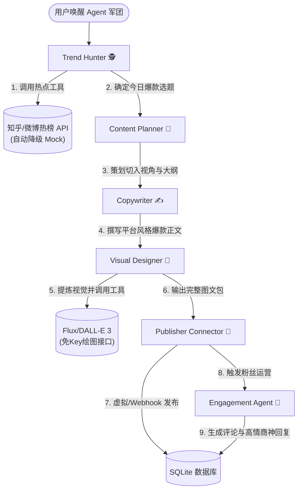

# 🚀 AI Social Media Manager (智能自媒体矩阵运营管家)

[](https://fastapi.tiangolo.com/)
[](https://www.python.org/)
[](LICENSE)
[](https://github.com/yourusername/ai-social-media-manager)

这是一个极具含金量、开箱即用的 **全自动自媒体内容创作与运营智能体 (AI Agent)** 开源项目。专为想要深入理解大模型 Tool-Calling、多智能体协同机制以及异步流式响应 (SSE) 的团队与开发者打造。旨在展现大模型落地应用与智能协同的卓越技术架构！

---

## 🌟 项目三大核心技术优势

1. **手写 ReAct 思考与工具调用 (Tool-Calling) 引擎**
   - 拒绝套用繁重且不稳定的三方 Agent 框架，**完全基于原生 Python 异步编排手写 ReAct 机制**。通过自定义的 System Prompt 和正则表达式，实现高鲁棒性的工具参数解析、异常重试与自我纠错，大幅提升了系统的执行效率、可控性与容错能力。
2. **多智能体状态机流转与异步 SSE 架构**
   - 实现了一个多角色的智能体开发团队（Trend Hunter 🕵️, Content Planner 🧠, Copywriter ✍️, Visual Designer 🎨, Engagement Agent 💬）。
   - 前后端通过 **SSE (Server-Sent Events) 与 asyncio.Queue** 实现事件驱动通信，可在前端 Dashboard 中**像打字机一样实时看到每个 Agent 在想什么（CoT 思考轨迹）和调用工具的步骤**。
3. **开箱即用的高可用双重模式（零成本演示）**
   - 具有**沙箱模拟模式 (Sandbox Mode)**：无需配置复杂的社交平台官方 API，即可生成精美的本地数据与效果。默认集成**免费免 API Key 的图片生成服务**与热点抓取，极大降低开源用户门槛，极具吸引 Star 的潜力。

---

## 🧭 多智能体协同工作流 (Agent Workflow)



---

## 🛠️ 技术栈与架构

- **后端核心**：Python 3.10+、FastAPI (异步高性能 Web 框架)、SQLAlchemy
- **大模型支持**：完全兼容 OpenAI 协议。支持 OpenAI、Gemini、DeepSeek 以及 **Ollama 本地运行模型**
- **存储**：SQLite (通过数据库归档每一次运营成果与思考日志)
- **前端页面**：现代 CSS 暗黑科技风 + 磨砂玻璃质感 (Glassmorphism)，包含流式日志终端、选题面板、推文预览区和历史画廊。

---

## 📂 项目结构

```text
├── app/
│   ├── config.py              # 环境读取与核心配置
│   ├── database.py            # SQLite ORM 定义与连接
│   ├── main.py                # FastAPI 路由、SSE 推送逻辑
│   ├── agent_engine/          # 手写智能体引擎核心
│   │   ├── base.py            # ReAct BaseAgent 引擎与 Tool 包装器
│   │   ├── team.py            # 多智能体协同调度器 (Workflow Engine)
│   │   └── prompts.py         # 各 Agent 角色设定 System Prompt
│   ├── tools/                 # Agent 可调用的工具库
│   │   ├── hot_trends.py      # 热搜抓取 (知乎 API/Mock 选题库)
│   │   ├── image_generator.py # 图像生成 (DALL-E 3/HF 免费推理 API)
│   │   └── publisher.py       # 内容发布器 (模拟发布/Webhook 转发)
│   └── templates/             
│       └── index.html         # 高级暗黑风单页面 Dashboard
├── requirements.txt           # 项目依赖
├── run.py                     # 一键启动脚本
└── .env.example               # 配置模板
```

---

## ⚡ 快速开始

### 1. 克隆与安装依赖
```bash
# 克隆项目
git clone https://github.com/yourusername/ai-social-media-manager.git
cd ai-social-media-manager

# 安装依赖
pip install -r requirements.txt
```

### 2. 配置文件
运行启动脚本后，系统会自动在根目录下复制生成一份 `.env` 文件。
```bash
# 大模型配置 (填入你的 API Key，如果不填，系统将进入完美的高拟真沙箱演示模式)
LLM_API_KEY=your-api-key-here
LLM_API_BASE=https://api.openai.com/v1
LLM_MODEL=gpt-4o-mini
```

### 3. 一键启动
```bash
python run.py
```
启动后，打开浏览器访问 **👉 http://127.0.0.1:8000**，即可体验极具科幻感的智能矩阵运营过程！


